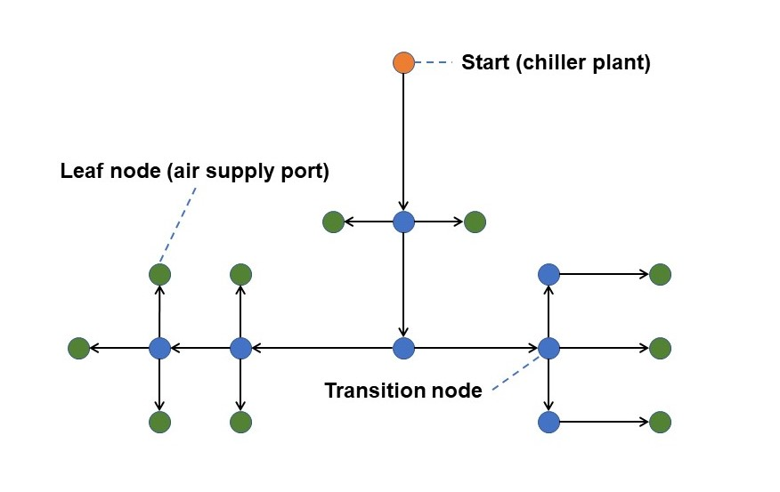
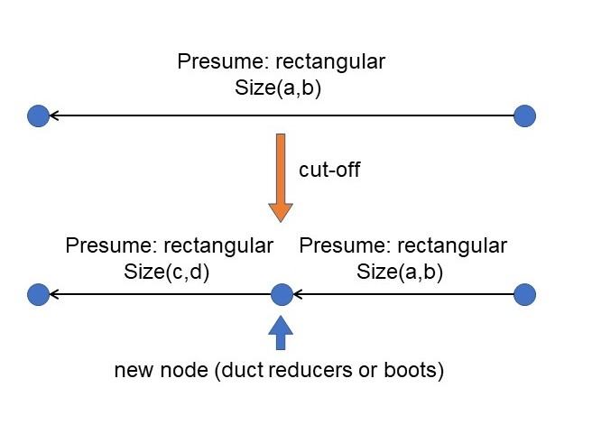

# Background

Air distribution plays an important role in human thermal comfort in built environment. HVAC (Heating, Ventilation, Air-Conditioning, and Cooling) sytems are the core to ensure it. Compared with nominal capacity of core equipment, Terminal air distribution system seems not to get enough attention, especailly when it comes to BIM (Building Information Model) era.

BIM facilitates the automation in construntion, but there is a long way to go. For example, Construction Drawing Standard needs to be recieved and embraced widely, which can help the ***ducting generation*** of centralized air distribution system. ***Identifying the geometry and use of every space is indispensible in the ducting generation***. It is not uncommon to hear that the ducting generation is labor-intensive, which means that the increasing powerful machine can liberate engineers from the "trivial" and boring work. ***But the ducting generation is the foundation of the automatic hydraulic calculation***. so what's our current difficulties?


graph LR
A[previous 2D drawing] --> B[automated BIM generation]
B --> C[automated ducting generation]
C --> D[automated hydraulic calculation]

&nbsp;

# Bottleneck

The potential of soft- and hard-ware firstly shines through Computer Vision(CV) and Nautre Language Process(NLP) . one of reasons we cannot ingore is data collection: the tremendous amount of textual and visional data. Back to the construction industry, it is really ***hard and time-consuming to put all data in hand into some well-developed data structure***, including IFC[1] and gbXML[2].

Automated 3D model creation (for example, a quasi-automated BIM methodology) has been researched and bullet points have been extracted, like line-text extraction[3], which establishes the solid foundation of the ducting generation. However, The tendency of automated ducting generation has not come yet, at least in the construction industry. Let's wait and see.

# How to Automate Hydraulic Calculation

## an Abstract routing

Given that we get the abstract routing in hands, which results from the automated ducting generation. Generally **an abstract routing consists a bunch of straight lines as the axis of every straight tube, and they interact with 90-degree corners**. Like the following graphic, the orange point usually is located at one of the building chiller plants. blue points show tranches from this point. Green points provide air for users.

## Data Structure of an Abstract Routing

NetworkX is a good choice for someone who's new to this field. Abstract routing is a path search problem. By the way, if you are interested in Automated Ducting Generation. [A* search algorithm](https://en.wikipedia.org/wiki/A*_search_algorithm) and [Dijkstra's algorithm](https://en.wikipedia.org/wiki/Dijkstra%27s_algorithm) are classic methods.

Let's go back to the Data Structure. Recommend reading the [NetworkX tutorial](https://networkx.org/documentation/latest/tutorial.html). The NetworkX built-in Data Structure `graph` is a good candidate to save abstract ducting. You can customize the attributes of `edge` and `node`. For instance, `location` can be added in `node`, and `weight` can be added in `node` as Euclid distance. By the way, `location` can be 2D or 3D coordinates. **This step is to program the above graphics**, which is the foundation of the next Hydraulic Calculation.

## Hydraulic Calculation

1. **sizing (Duct)**: one of the goals is to determine the size and shape of every duct. You need to consult the **relevant national construction codes** (RNCCs), whether the shape is round or rectangular. This step involves data in BIM.
  
2. **sizing (Duct Connectors & Transitions)**: You must notice the blue points in the above graphics. RNCCs will tell you how to size.
  
3. **sizing (Duct Reducers & Boots)**: We need to convert abstract ducting into physical air distribution systems, so every `edge` has a certain amount of air volume. RNCCs require the upper and lower limit of air velocity, which means too long `edge` might be unable to reach the mandatory, and it should be cut off into two `edges`.
  
4. **sizing (Valves)**: The abstract ducting might not consider the valve installation. For sake of hydronic balance, some valves are necessary. In air distribution systems, `edges` will be classified into the main duct, branch, etc, which is based on the location. You can go through RNCCs to judge. If it is necessary, you can add the categories to attributes, which helps you to add valves. Theoretically, one `edge` is cut off into two `edges`, and the new `node` represents.
  
5. **check (hydronic balance)**: Our ultimate goal is to ensure that the practical air volume is equal to the theoretical air volume. According to the shortest path to every leaf node, you can calculate the resistance of every patch to check. The feedback can guide you on how to modify sizing. Under some circumstances, the abstract ducting needs to be improved, for example, the size of **the Duct Accessary** (Reducers, Transits, Reducers & Boots) will squeeze the space of the duct. The iteration between Hydraulic Calculation and Automated Ducting Generation is necessary.
  

# Conclusion


graph TB
A[collection data] -.-> B[Abstract Routing]
A -.-> C[BIM]
B & C -.-> BC[combination] 
BC -.-> DEF[sizing]
DEF -.-> D["sizing(Duct)"]
DEF -.-> E["sizing(Duct Connectors & Transits)"]
DEF -.-> F["sizing(Duct Reducers & Boots)"]
D & E & F -.-> G["check(hydronic balance)"]
G -.-> H{"balance?"}
H -.->|Y| I[Done]
H -.->|N| J[Modify]
J ==> DEF
J ==>|iteration| B

&nbsp;

# Acknowledge
1. This work is one part of a larger project about Auto-Design for HVAC System of Public Buildings. The inital floorplan here is one of the test models for this lager project.

# Reference

1. [GitHub - Autodesk/revit-ifc: IFC for Revit and Navisworks (2019+)](https://github.com/Autodesk/revit-ifc)
  
2. [Homepage | gbXML](https://www.gbxml.org/)
  
3. Shilin Wu, Yan Wang, Huayu Yang, Pingfeng Wang. (2022) Improved Faster R-CNN for the Detection Method of Industrial Control Logic Graph Recognition. *Frontiers in Bioengineering and Biotechnology* 10.
  
4. [NetworkX tutorial & documentation](https://networkx.org/documentation/latest/tutorial.html)
  
5. [A* search algorithm - Wikipedia](https://en.wikipedia.org/wiki/A*_search_algorithm)
  
6. [Dijkstra's algorithm - Wikipedia](https://en.wikipedia.org/wiki/Dijkstra%27s_algorithm)