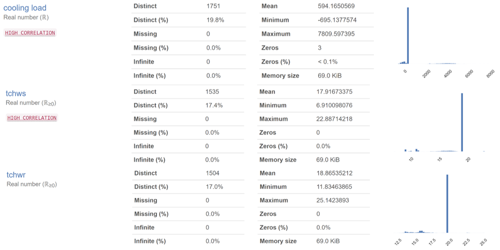
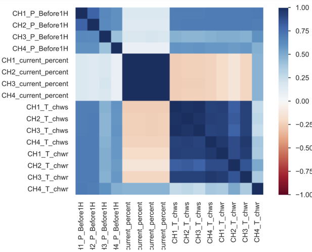
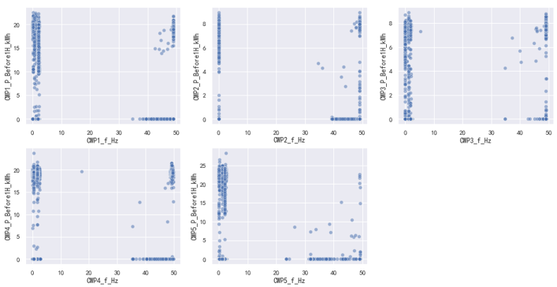

# Background

When I was Year Two student in my master's study, it was the first time to explore the potential of engineering big data related to building HVAC systems. Before that, I was used to using synthetic data to verify ideas due to its ***controllability***. If you have ever had similar experiences, you can understand what I mean. Although I was intuitively afraid of being involved in do with engineering data, I had no idea what is the core problem until I got a task.

# What's the Task?

A property agency found that ***the frequency of fans in cooling towers is consistent all year around***, which means there was plenty of room to improve its operation for sake of energy-saving. As we all know, the building's thermal load changes along with the ambient temperature. The partial thermal load means the lower frequency still is able to process the thermal load. We can save energy consumption and reduce carbon emissions without sacrificing thermal comfort. The above analysis makes everything clear.

**The goal is a strategy for controlling the frequency of fans in cooling towers**. In order to make strategy easy to operate, my initial plan is to make a look-up table.

# What's the Data we can make Full Use of?

The agency provided me with the data collected in half of the year 2020. Apart from every 15-minute electricity consumption, other data shed more light on the operation of the building's HVAC systems. All the data have been listed in the next mindmap. Little emphasis has been put on thermal comfort, so indoor temperature not in our range.


mindmap
  root(("equipment & data"))
    Chillers
      Electricity Consumption
        every 15 min for each chiller
        every 15 min for all chillers
      Operation
        on or off
        current percentage
    Chilled Water Pumps
      Electricity Consumption
        every 15 min for each pump
        every 15 min for all pumps
      Main Water Flow in Chilled Water Loop
      real ime frequency of every pump
    Cooling Water Pumps
      Electricity Consumption
        every 15 min for each pump
        every 15 min for all pumps
      main water flow in cooling water loop
      real time frequency of every pump      
    Cooling Tower
      Electricity Consumption
        every 15 min for each fan
        every 15 min for all fans
      Main Leaving Water Temperature
      real ime frequency of every fan
    Others
      Ambient Temperature
      Relative Humidity

&nbsp;

# What did I Learn and What Tools did I Use?

In this part, I'll show you some tools that can get you a quick start. The first one is [ydata-profiling](https://github.com/ydataai/ydata-profiling), whose name is pandas-profiling. It can give you a one-line Exploratory Data Analysis (EDA) experience, especially if you are new to expert data analysis. This third package gives me a cursory review of how bad raw engineering big data. `cooling load` is the real-time thermal load for one building. `tchws` is the main temperature of the water leaving chillers. `tchwr` is the main temperature of the water entering chillers. The below graphics illustrate that the engineering data is much poorer than I thought, which is really shocking to the point where I do not know what I have to do next. More importantly, ***the ratio of zero cannot reflect the data-missing reality, because `-9999` and minus values mean data-missing in practice***.

***The heatmap based on the correlation matrix tells us something defying the laws of physics***. `P_BeforeH`means the electricity consumption of the previous hour. `current percent` can be approximately regarded as the average chiller current percentage in the previous hour. `T_chws` can be approximately regarded as the temperature of the water leaving the chiller. `CH1` means chiller No. 1. The lighter the square is, the weaker the correlation between the two variables. The electricity consumption should be strongly related to the current percentage, but the heatmap could not be it. which further illustrates there is much a bunch of problems to fix before making full use of these engineering big data.

Data Missing and anomalies are the common issue that most researchers notice. but ***Mismatching between labels and data has not gotten equal attention***. For example, ***one data label records the real-time frequency of fan #1 in cooling tower #1, but actually, this data belongs to the sensors installed on fan #3 in cooling tower #4***. That is not rare. But most of the time the energy consumption data get the moment. Let me use a solid example to prove it. Look at the next diagrams. ***The relationship between frequency and power should be the cubic curve***. By the way, `CWP` means cooling water pump, but we cannot see this corresponding relationship in diagrams (drawn by [seaborn](https://seaborn.pydata.org/)). ***the upper-right points only illustrate that more than one cooling water pump is on at that time***.

# Conclusions

This article just makes a brief introduction to problems closely related to HVAC systems. As long as you need to engage yourself in engineering data. The things I mentioned before you should be careful about.

The HVAC engineering data IS much different than other commercial data. ***<u>The preprocess is much more complicated and bothering, especially when it comes to multi-variables. The coupling property of physical systems cannot be ignored.</u>*** Good luck!

# Acknowledge
1. All the data this article mentions come from industry.
2. The first picture cited at the beginning is from [Unsplash.com](https://unsplash.com/) and Photographer [*Myriam Jessier*](https://unsplash.com/@mjessier)

# Reference

1. [Overview &mdash; ydata-profiling 0.0.dev0 documentation](https://ydata-profiling.ydata.ai/docs/master/index.html#)
  
2. [GitHub - mwaskom/seaborn: Statistical data visualization in Python](https://github.com/mwaskom/seaborn)