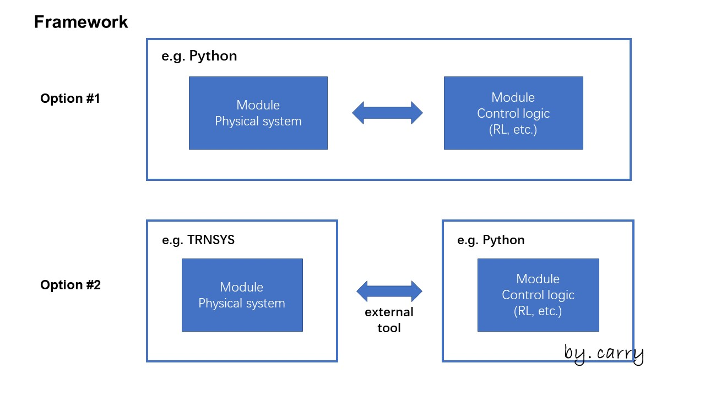
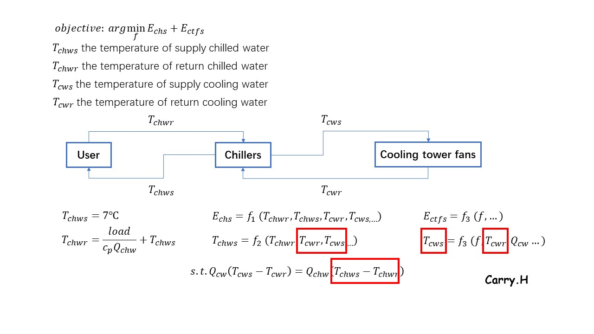
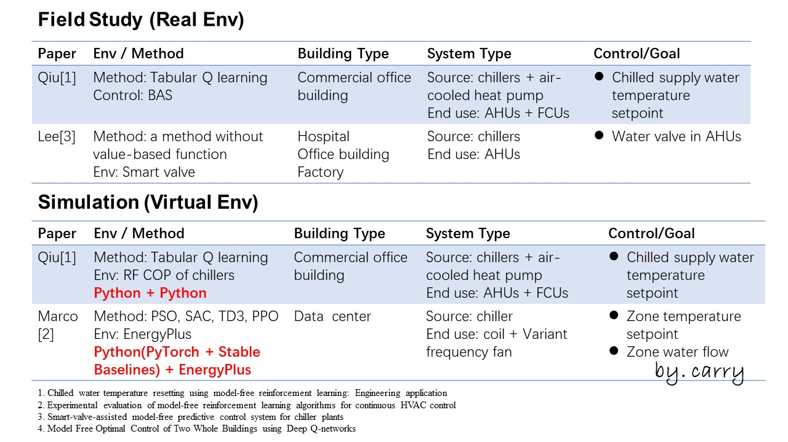
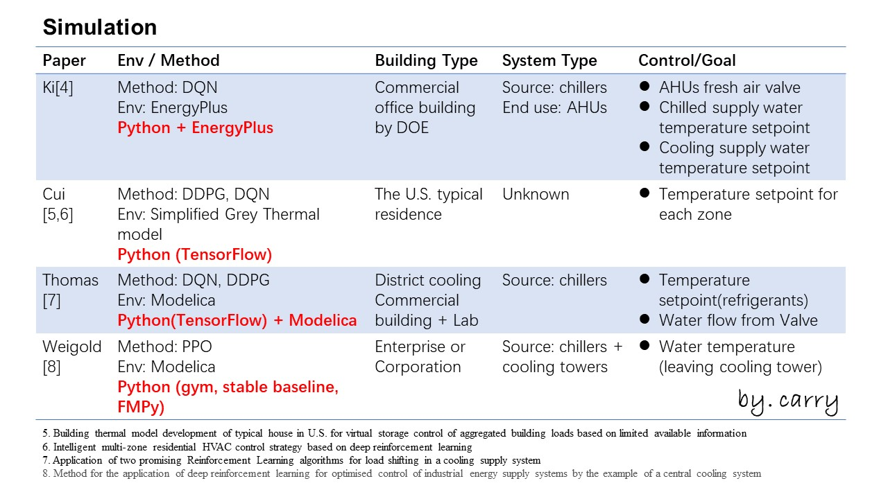

# Background

Researchers have proven the potential of (Deep) Reinforcement Learning in improving building energy efficiency. The maturity of digital infrastructure motivates more and more companies to embark on deploying RL / DRL in reality because we are stuck in PID control for so long! During my internship, I summarized how to train RL in a virtual environment that is created by the actual building, which sounds like a hot concept '[MPC (Model Predictive Control)](https://www.sciencedirect.com/science/article/pii/S1367578820300584)', but they are essentially different.

RL only needs one environment, regardless of the virtual or actual environment. Here, the emphasis is put on a virtual environment just for pre-training agents. In another word, if we train RL in the actual environment, the whole building operation would be so unstable to get complaints that are what we don't want. But in MPC, a virtual environment (or we can say, model) is a bridge connecting the control algorithms (can be RL or other methods) and the actual environment. The former Sequence diagram illustrates the workflow of RL/DRL, and the latter shows the simplified workflow of MPC.


sequenceDiagram
    Control Method->> Environment: command N based on the feedback from N-1
    Environment-->>Control Method: feedback N based on the commnand from N

    Control Method->> Environment: command N+1 based on the feedback from N
    Environment-->>Control Method: feedback N+1 based on the commnand from N+1

    Control Method->> Environment: command N+2 based on the feedback from N+1
    Environment-->>Control Method: feedback N+2 based on the commnand from N+2

&nbsp;


sequenceDiagram 
    Environment ->> Model: Information N+1 based on information iteration N——update Model
    Model ->> Control Method: Output N+1 based on information N+1&information iteration N
    Control Method-->> Environment: Command N+1 based on Output N+1

    Environment ->> Model: Information N+2 effected by Output N+1&Command N+1——update Model
    Model ->> Control Method: Output N+2 based on information N+2
    Control Method-->> Environment: command N+2 based on Output N+2

    Environment ->> Model: Information N+3 effected by Output N+2&Command N+2——update Model
    Model ->> Control Method: Output N+3 based on information N+3
    Control Method-->> Environment: command N+3 based on Output N+3

&nbsp;

# Framework

Generally, if we want to train RL in a virtual environment, ***two parts*** and ***one connection*** needs to be considered.

1. **two parts** are physical system module and control module respectively
   1. **physcial system module**: descibe certain physcial system <u>mathematically</u>. For example, in the mathematical description of a building HVAC system, we need chiller mathematical models or other core equipment models in accordance with your personal needs.
   2. **control module**: the module encompasses the <u>control logic</u>, you can design whatever you like as control logic, including RL or other fancy algorithms.
2. **one connection** is how to connect these two modules
    1. **situation 1**: <u>it depends on how to deploy the foregoing modules</u>. If the foregoing modules are deployed in the same place, (e.g. two modules are written in Python), the connection can be ignored. 
    2.  **situation 2**: Alternatively, the physical system module is built in certain simulation software, like TRNSYS, and then the control module is Python file. Under this circumstance, you need some external tool to communicate.

# Tools Useful for Modules and Connection

## Module: Physical system

There are two ways to build a physical system mathematically. Firstly, you write the key components from scratch. Here is a really versatile tutorial you cannot miss. [Energy Reference](https://energyplus.net/assets/nrel_custom/pdfs/pdfs_v22.2.0/EngineeringReference.pdf) can tell you the prototypes of the key components. For example, in ENERGYPLUSTM VERSION 22.2.0 DOCUMENTATION, on Page 795, it explains the EIR Chiller model that is really popular in various research. EIR is a kind of regression model. In the same way, you can find mathematical models of cooling towers and water pumps. You can use [scikit-learn](https://scikit-learn.org/stable/) or other toolkits to achieve your goals.

Alternatively, current simulation software can help you build a physical system, including [TRNSYS](https://www.trnsys.com/), [Dymola](https://www.3ds.com/products-services/catia/products/dymola/), [Open Modelica](https://openmodelica.org/), [EnergyPlus](https://energyplus.net/). I recommend the last two out there due to their property of open source. EnergyPlus has an in-built Python API. Open Modelica and EnergyPlus represent micro (system) and marco (building) respectively.

## Module: Logic control

The discussion range will be limited in some state-of-art algorithms. [scikit-learn](https://scikit-learn.org/stable/) is one of the most popular python packages I guess. Maybe you can find something useful for you. Here I want make a cursory introduction on some (D)RL third party package, like [Stable-Baselines](https://stable-baselines.readthedocs.io/en/master/), [keras-rl](https://github.com/keras-rl/keras-rl), [MushroomRL](https://mushroomrl.readthedocs.io/en/latest/), etc. If these foregoing packages cannot meet your requirements, you change it.

## Connection

This part is not my strong suit because my preference is option #1 in the above graph. I have a little knowledge in this aspect: [FMPy](https://github.com/CATIA-Systems/FMPy) and [FMI](https://fmi-standard.org/). Long story short. Functional Mock-up Units are something you need.

But option #1 also have something really annoying to handle: decouple the parameters. To simplify this concept, one parameter can be effected by more than one chillers. It can be an input of equipment #1 and output of equipment #2. I'll give you a control task to appreciate that:

You wanna control the frequency of all cooling tower fans for the sake of energy efficiency:

   1. action: the (uniform) frequency of cooling tower fans $f$
  
   2. objective: $\underset{f} { \operatorname {arg\min}} \ {EnergyConsumption_{Chillers+CoolingTowerFans}}$
  
   3. subject: make sure the thermal comfort $s.t. \ T_{chs}=7 \ Celsius$
  
There two kinds of equipment in *objecive*, so two kinds of modules are involved in this virtual environment. two parameters `T_cwr` and `T_cws` (temperature of return/supply cooling water) will effect these two modules, they can be regarded as inputs in cooling tower fan model and outputs in chillers. Other thing you need to consider is the laws of energy conversion. the amount of heat transfer should be the same in both cooling and chilled water loop. I plan to illustrate the issue about decoupling. The blod red boxes are something you need to consider how to determine because they are connected each other.

## Example

To be more understandable, I made a [GitHub repository](https://github.com/Hurricane-k/BuildingEfficiencyAgent_in_VirtualEnv) to examplify the above, you can [click here](https://github.com/Hurricane-k/BuildingEfficiencyAgent_in_VirtualEnv) to know more details. You can download and clone if you are interested in it.

In the GitHub example, I use to two methods, model-based (traditional) and model-free (mentioned in this blog), simultaneously. You can see their differences straightforwardly. Model-based method needs to build models of equipment inner mechanism for optimal control set (optimization methods or ergodic).

Model-free based method is used to allocate load between chillers of different make and models. Model-based method is applied to cooling tower (the number of cooling towers under operation and the frequency of fans in cooling tower). Other details have been disclosed in [README.md](https://github.com/Hurricane-k/BuildingEfficiencyAgent_in_VirtualEnv).

# Literature (A Collection of Case Study)

I plan to end up with a collection of case study. Many previous papers have verified the deployment of RL in real or virtual environments. I pick up some case study to share with you all. I summarize them following these criteria: environment, method, building type, system type, and control (goal).

# Acknowledge

1. Its content is finish during my internship. Thank you for the inspiration from the team where I stayed.
2. The first picture cited at the beginning is from [Unsplash.com](https://unsplash.com/) and Photographer [*Pedro Lastra*](https://unsplash.com/@peterlaster)

# References

1. Drgoňa, J. et al. (2020) All you need to know about model predictive control for buildings. *Annual reviews in control.* [Online] 50190–232
2. [Energy Reference - PDF Documentation from EnergyPlus](https://energyplus.net/assets/nrel_custom/pdfs/pdfs_v22.2.0/EngineeringReference.pdf)