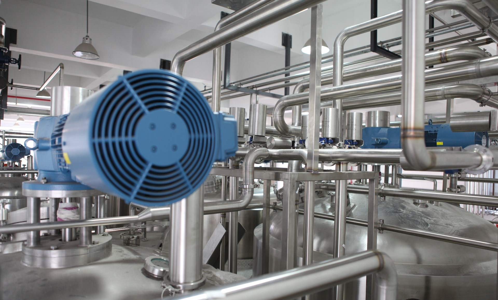
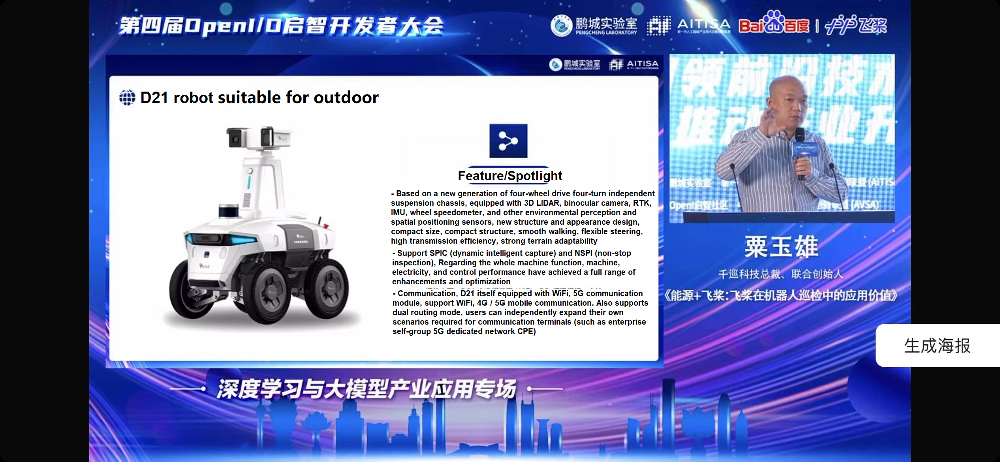
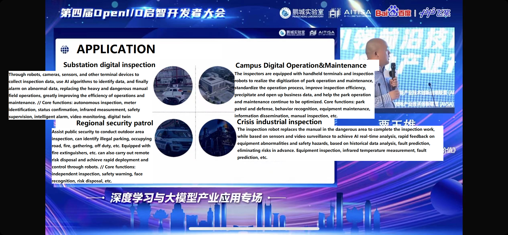
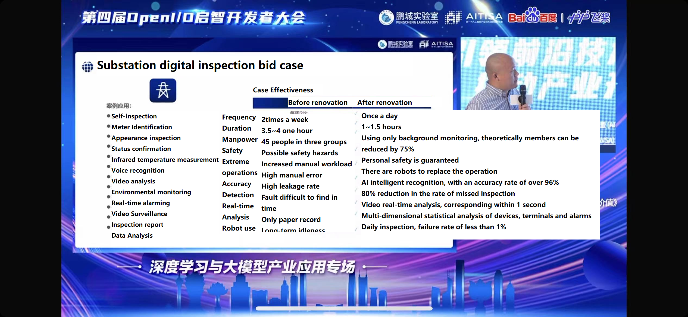
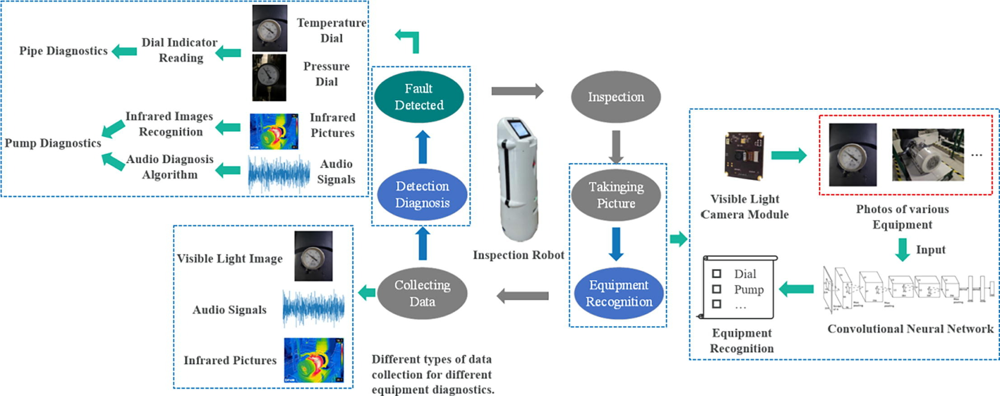
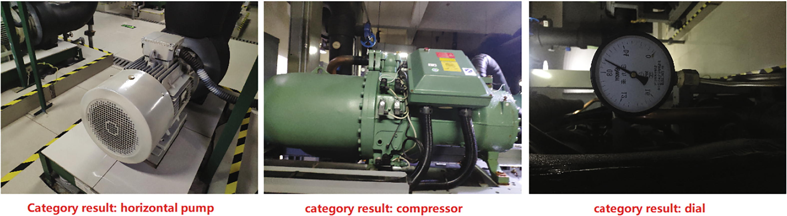
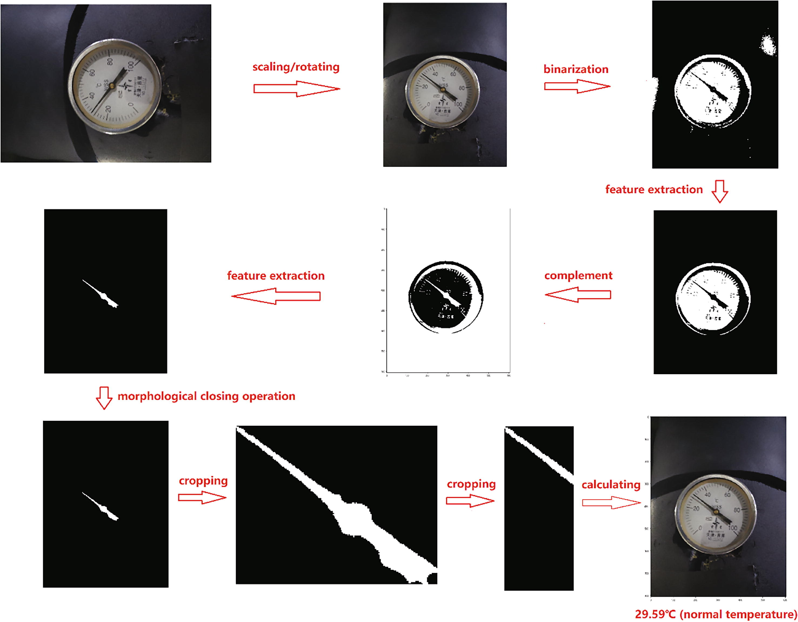
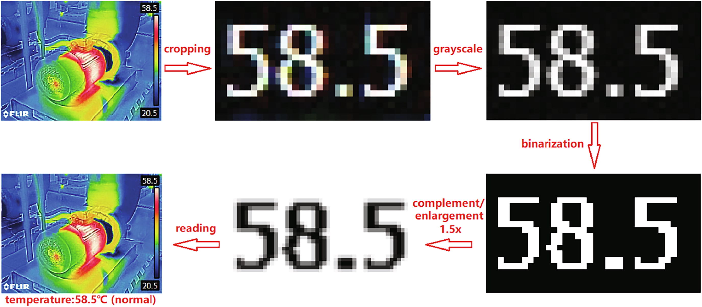

# Background

Industrial Fault Detection and Diagnosis (I-FDD) are in the process of deployment in practice, which is inspiring and exciting. For example, the latest inspection robots showed up at the 4th BAIDU OpenI/O QIZHI Developers Conference, which has come to end. The robot is typically designed for the transformer substations, which take into account the complex layout (steps, slope, etc.). It occurs to me that my previous experience, in which I was involved in developing and testing the algorithms for FDD based on the inspection robot in the chiller plant. The recent events indicate the inevitable tendency to digitize the job of inspection. After all, the position related to plant inspection work is uncomfortable for people. The inspection robots can reduce the miserable burden for human beings to a certain degree.

# Goals

Our previous work aims at Fault Detection other than Fault Diagnosis. Both concepts are essentially different. Fault Detection is the foundation of Fault Diagnosis. Fault Diagnosis is the further step of Fault Detection. Disclaimer: the following description dedicates that the inspection robot needs to be equipped with more than one camera sensor, more than one microphone (or audio sensor), and more than one infrared sensor.

Our algorithm consists of a few parts: image recognition by RGB images, fault detection by infrared photos, fault detection by RGB images, and fault detection by audio. The inspection objects include the critical components in chiller plants: pipes, chillers, and water pumps. 


flowchart LR
    A[Our Solution\n for Fault Detection] --> B[Data]
    B --> B1[RGB images]
    B --> B2[infrared photos]
    B --> B3[audio]
    B1 --> B11[equipment photos]
    B1 --> B12[dial photos]
    B11 --> C1[equipment\n classification]
    B12 --> C2[inspect the\n temperature\n or pressure\n of pipes]
    B2 --> C3[inspect the temperature\n of equipment]
    B3 --> C4[detect whether or not\n equipment has problems]

&nbsp;

# RGB Image-based Equipment Classification

When the robot patrols the chiller room, it takes many pictures (of ***chillers***, ***water pumps***, ***temperature dials***, and ***pressure dials***) with the help of technology Light Detection and Ranging (LIDAR), which is a method for measuring distances by illuminating the target with laser light and measuring the reflection with a sensor. When the equipment is identified accurately, further diagnosis makes sense. We adopt the modified AlexNet to recognize by the RGB images. The feature extraction remains unchanged, and the part of the classification is rebuilt according to the requirements of the issues to be addressed: to change the output of the fully connected layer to 4 (Number 4 means the things we mentioned before). In model training, only the parameters for the classification are updated. The rotated and mirror are used to enhance the images we have.

# Dial Indicator Reading

It is rare to see dials in recently-built plants, but they are common in some old plants, usually telling engineers the pressure and temperature in pipes. This part can digitize the old plants at a low cost: reading dials and identifying the values.


flowchart LR
    A["Inital RGB\n iamge(dial)"] --> B["Scaling/Rotating"]
    B --> B1["R-channel\ngrayscale"]
    B --> B2["G-channel\ngrayscale"]
    B --> B3["B-channel\ngrayscale"]
    B1 & B2 & B3 --> C[AND]
    C --> D[Extract\n Pointer]
    D --> E[Calculate the Angle\n Between Needle Tip\n and the Negative Y-Axis]
    E --> F["Convert Angle\n to Temperature/Pressure"]
    F --> G["Fault\n Detection"]


Standardized photography should be obtained before reading the dial to make the readings more accurate. As a side note, the dial should be vertical and centered on the photograph. This part of the algorithm can be divided into three parts:

1. identify the position of the pointer.  
2. calculate the angle between the pointer and the negative y-axis, which help us obtain the angle between the pointer and the zero mark.  
3. convert the angle between the pointer and the zero mark to the corresponding pressure or temperature value.
4. Image scaling/rotating mainly involves adjusting the image's resolution and size without losing the necessary information. When the ratio of height to width of the input image is less than 1, it is designed to rotate 90° counterclockwise.

# Recognition in Infrared Images

The temperature of a piece of running equipment is also a key indicator of whether or not the condition is good. In every infrared image shot by FLIR infrared cameras, reading the number in the upper right corner helps the staff to know the highest temperature.


flowchart LR
    A[Intial\n Infrared Image] --> B[Image Cropping]
    B --> C[Image\n Grayscale]
    C --> D[Image\n Binarization]
    D --> E[Image\n Enlargement]
    E --> F[Reading\n OCR]
    F --> G[Temperature]


Using the temperature reading of the infrared pump image as an illustrative example, it is achieved with the help of Python’s [pytesseract](https://github.com/tesseract-ocr/tesseract) and [skimage](https://github.com/scikit-image/scikit-image). The proposed algorithm can accurately read the temperature on an infrared image. The identified maximum temperature of the pump can help the purpose of fault diagnosis. By the way, the proposed non-intrusive approach cannot measure the maximum temperature of the internal part of a motor.

# Audio-based Fault Detection

Generally, when a piece of equipment is in good condition, the sound that it generates would smooth. When equipment cannot work well, the sound usually becomes sharp. Our audio-based method utilizes this property. If we can determine the threshold between smooth and sharp sounds, some problems can be detected in time.

The typical signal process inspires this part. Discrete Fourier Transform (DFT) converts audio from the time domain to the frequency domain. Usually, the audio is a mix of the sound from the target and the sound from other equipment. So separating the target's and other equipment's sounds is essential before analyzing the frequency domain. DFT can help us do this. The result of DFT can give us a clear visualization of the frequency domain.

In our audio-based detection, we use the ARIMA model, usually applied in financial analysis, to fit the pump high-, medium-, and low-frequency domain signals. If the audio is non-smooth, the d-order difference operation is first performed to turn it into a smooth time series. For smooth audio, the ARIMA model is used directly. So we can identify smooth and other audio.

# Acknowledge
1. ***Big big thank you to some of my older research group mates. They made the majority of contributions to this work. Without him, this work cannot be here. They are so nice and patient to help me to start other research independently.*** If you are interested in our study, or if it inspires you, don't hesitate to click [here](https://www.sciencedirect.com/science/article/pii/S0378778821002516) to learn more details.
2. **Big big thank you to some companies who trust us and sponsor us to start and improve the idea of the inspection robots.**
3. The first picture cited at the beginning is from [Unsplash.com](https://unsplash.com/) and Photographer [*Crystal Kwok*](https://unsplash.com/@spacexuan).

# Future Work

1. Regarding our audio-based Fault Detection, sharp sounds cannot represent all problems the engineers would come across. Given the lack of collection of abnormal audio, it is nearly impossible to analyze more sound-related features from equipment that operates in good condition. Deliberately damaging a piece of equipment is unaffordable. If the collection of sounds has more diversity, a more detailed analysis will help to develop a more refined audio-based Fault Detection method.
2. It is not flexible to read dials in our design because the dial photos are required to be shot against a black background. The colorful background would make our method cannot work well. In the future plan, this part of the method will be improved to face more complicated situations.
3. The rapid development of large AI models makes AlexNet relatively old-fashion. This part should be improved by following the latest technologies. In addition, the classification needs to be more detailed and encompass more equipment.

# Reference
1. R He, P Xu, Z Chen, W Luo, Z Su, J Mao, A non-intrusive approach for fault detection and diagnosis of water distribution systems based on image sensors, audio sensors and an inspection robot, Energy and Buildings, Volume 243, 2021, 110967, ISSN 0378-7788.
   
2. [Tesseract OCR in Python with Pytesseract andOpenCV](https://nanonets.com/blog/ocr-with-tesseract/)
  
3. [GitHub - tesseract-ocr/tesseract: Tesseract Open Source OCR Engine (main repository)](https://github.com/tesseract-ocr/tesseract)
  
4. [GitHub - scikit-image/scikit-image: Image processing in Python](https://github.com/scikit-image/scikit-image)

5. [Autoregressive Integrated Moving Average (ARIMA) Prediction Model](https://www.investopedia.com/terms/a/autoregressive-integrated-moving-average-arima.asp)