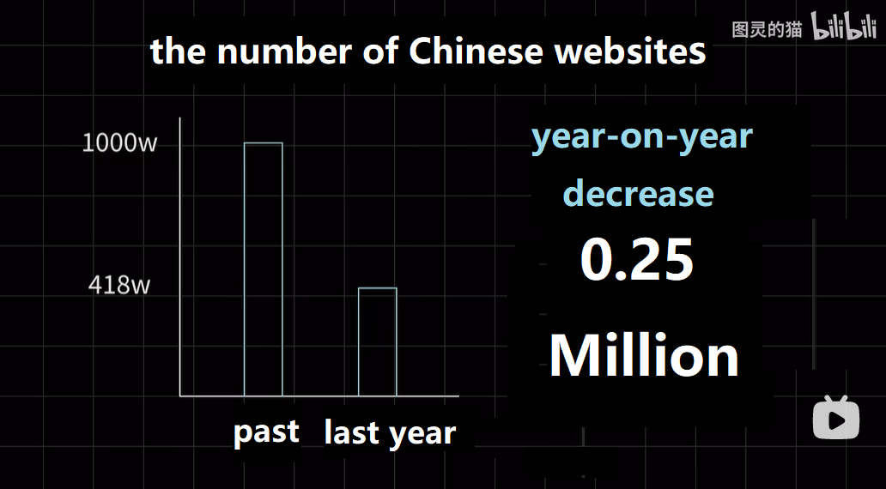
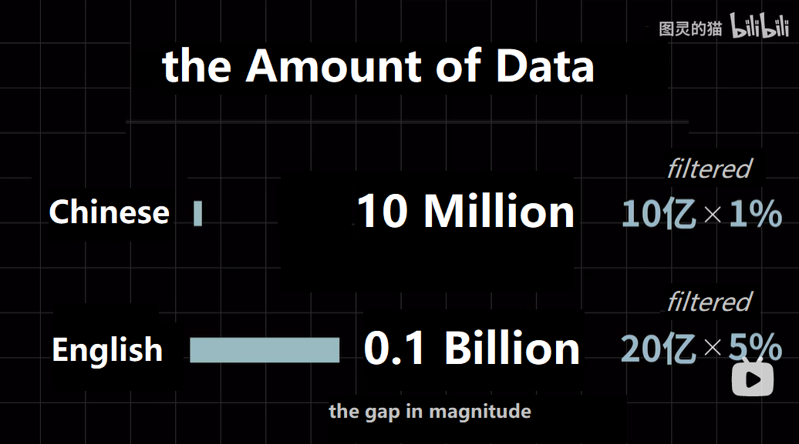

# Background

Large-scale Language Model (LLM) is eye-catching all around the world. It outshines other AI branches in reputation. In other words, describing LLM as the masterpiece set is ok. Some ideas derived from LLM also inspire other branches, like Prompt Learning. OpenAI has stirred up the madness that many tech giants put much effort into LLM. I want to talk about Chinese LLM especially. There is no debate that [BAIDU WenXiYiYan](https://yiyan.baidu.com/welcome) got its moment recently. Some people analyzed the technical or knowledge gap between the Chinese generative pre-trained transformer model (C-GPT) and OpenAI GPT. One thing we cannot ignore is that the excellent corpus is different in quantity and quality.

# Reference

1. [The Chinese online comunities are dying out, and who is killing the future of China's AI? [What is the obstacle of domestic ChatGPT]](https://www.bilibili.com/video/BV1Nm4y1z7AT?share_source=copy_web)