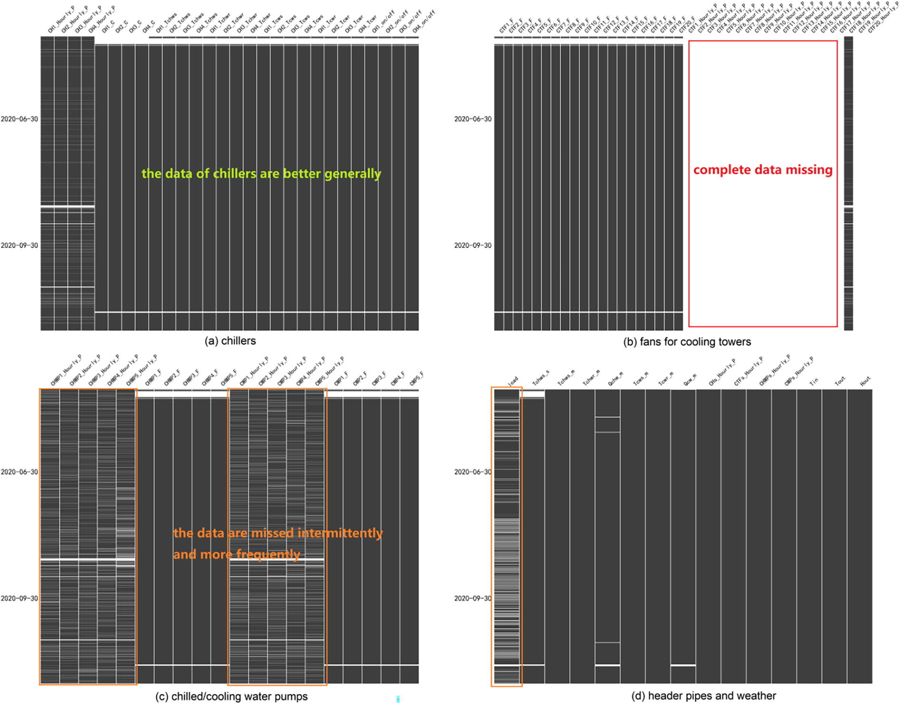
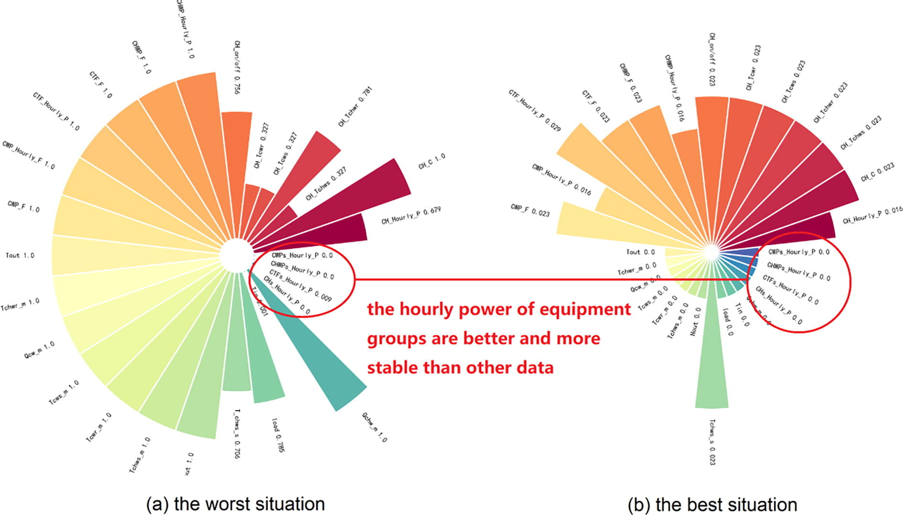

# Background

Large-scale Language Model (LLM) is eye-catching all around the world. It outshines other AI branches in reputation. In other words, describing LLM as the masterpiece set is ok. Some ideas derived from LLM also inspire other branches, like Prompt Learning. OpenAI has stirred up the madness that many tech giants put much effort into LLM. I want to talk about Chinese LLM especially. There is no debate that [BAIDU WenXiYiYan](https://yiyan.baidu.com) got its moment recently. Some people analyzed the technical or knowledge gap between the Chinese generative pre-trained transformer model (C-GPT) and OpenAI GPT. We cannot ignore that the excellent corpus is different in quantity and quality.

Clearly, the valuable data accounts for a small percentage, which is not limited to the natural language model. In terms of HVAC engineering data, the shortage is more severe. Some phenomena can explain that:

1. The building energy consumption monitoring platforms are at the initial stage of development. There are many differences among platforms in quality, which is a typical feature. People put much more emphasis on the quantity of the platforms with the sacrifice of the quality.
  
2. The Covid-19 pandemic pauses or breaks the consistent record more or less, including building energy consumption and other relevant data. The inconsistent data would put some obstacles to data analysis and mining. But look on the bright side; it might be an opportunity to challenge some existing AI methods in practice.
  
3. Some maintainers are not equipped with enough expertise to find some platform-related problems in time, which would make platforms record tons of abnormal data over a long period.

# Analysis for Status Quo of HVAC Engineering Data

The part is limited to mainland China due to resource limitations, so the following conclusion might not be suitable for other regions. Let me introduce the data involved here. We use more than 100 commercial complexes to make our analysis convincing. We analyze not only energy consumption but also equipment operation condition, like real-time frequency, water flow, temperature, etc. The following diagram illustrates the relationship between the different kinds of data. By the way, we put all our emphasis on the chiller plants. The terminal air distribution system is not taken into account.

These research objects are located in different climate zones. Although we don't care about the climate impact on data quality, the diverse locations indicate various construction contracts on building energy monitoring platforms, which can demonstrate the diversity in data quality. In our research, we deliberately avoid model platforms because they will affect our judgment on the status quo of the platforms in markets.

First, I'll utilize [a helpful gadget](https://github.com/ResidentMario/missingno) to visualize the data quality. One strip means one data. For example, one data here can be the hourly energy consumption of a piece of equipment or the real-time frequency of a water pump. Anyway, one data is a time series. The data label shows on the top of every strip. If you wanna know the rule of naming, you can find detailed information [here](https://www.sciencedirect.com/science/article/pii/S0378778822005436).

Clearly, these data are varying in quality. For example, chillers can get quite good maintanence because their data are pretty consistent and stable. There is no much missing. Anyway, chillers accounts for the vast majority of electricity consumption in HVAC systems, so they can get priority. Instead, cooling towers don't get the enough attention and you can get it from the complete data missing in `hourly power`. That makes sense because they are not really energy-consuming.

These diagrams are derived from one building. Although this building is picked up randomly to visualization, you might say it is not convinving enough and it cannot represent the vast majority of buildings all around the world, but that can give us a glimpse of the status quo of HVAC engineering data, right?

In order to make our analysis convincing, we plan to extract some time-series-related features and using clustering algorithms to classify all kinds of data, which might give us an overview: what kind of data is better, and what kind is worst.

# Extraction and Clustering

The next table list a few features we use. Their goals are to find if there are certain relationship between data missing and data themselves. 
1. Some data alwalys have complete data missing. 
2. The consistent and long missing happen to certain kind of data (including `hourly power of a cooling tower fan` we mentioned before). 
3. The data missing is intermittent in certain kinds of data.

| No. | Features |
| --- | --- |
| 1   | the overall missing rate |
| 2   | the minimum time window |
| 3   | the average length of time window |
| 4   | the day of the week with maximum data missing rate (Mon, Tue, Wed, Thr, Fri, Sat, or Sun) |
| ... | ... |

And then we cluster all data based on these features. Here we use k-means and DBSCAN that depend on different theories. We are about to compare both results. Finally, we will analyze these data labels for each cluster. Before that, I'm gonna explain data naming rule: there are three parts: `Equipment Type_(Equipment No.)_data`. I will give you example, `CH_1_Tchwr` means the temperature of return chilled water of chiller #1. `CWPs_HourlyP` means means the hourly power of all cooling water pumps. When we analyze labels, `Equipment No.` will be omitted when it comes to one piece of equipment. Finally, we can find that the hourly power of equipment group is good and stable in quality, which means they can be foundation to correct other data.

Let me explain the above diagram a little bit. The left and the right pies are the worst and best situations respectively. For example, `CWPs_HourlyPower` in the red left circle is zeros means that the total missing rate of `CWPs_HourlyPower` is zero in the worst situation (in all buildings / one `CPWs_HourlyPower`corresponding to one building). The above description give us a hunch that we can use the energy consumption of quipment groups (`CHs_HourlyPower`, `CHWPs_HourlyPower`, `CWPs_HourlyPower`, `CTFs_HourlyPower`) as foundations to correct other data.

# Data Preprocessing Framework for HVAC Engineering Data


flowchart TD
    A[start] --> B[Plant\nHourly Power of all Chillers\nHourly Power of all Cooling Water Pumps\nHourly Power of all Chilled Water Pumps\nHourly Power of Cooling Tower Fans]
    B --> C1[Hourly Power of Chiller #1, #2,...]
    B --> C2[Hourly Power of Water Pump #1, #2,...]
    B --> C3[Hourly Power of Cooling Tower\nFan #1, #2,...]
    C1 --> D1[on/off of\nChiler #1, #2,...]
    C2 --> D2[frequency of Water\nPump #1, #2,...]
    C3 --> D3[frequency of\nFan #1, #2,...]
    D1 & D2 & D3 --> E[System\nthermal load\nDelta-T chilled water\nDelta-T cooling water\ncihlled water flow\ncooling water flow]
    E --> F1[Optional #1\nWeather Data]
    E --> F2[Optioanl #2\nwater temperature of Chiller #1, #2,...\nwater flow of Chiller #1, #2,...]
    E --> F3[Optional #3\nmain water temperature]


# Reference

1. [The Chinese online comunities are dying out, and who is killing the future of China's AI? [What is the obstacle of domestic ChatGPT]](https://www.bilibili.com/video/BV1Nm4y1z7AT?share_source=copy_web)
2. [GitHub - ResidentMario/missingno: Missing data visualization module for Python.](https://github.com/ResidentMario/missingno)