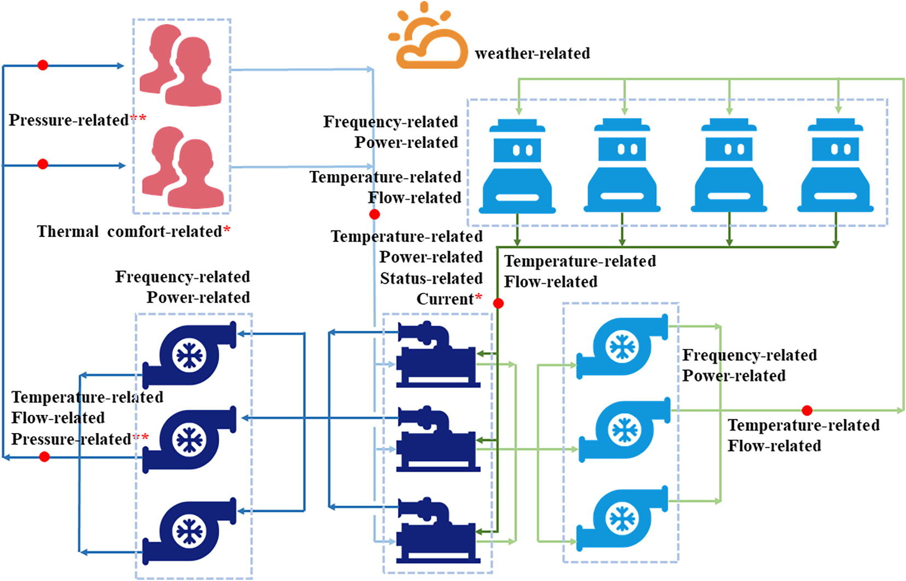

# Background

Large-scale Language Model (LLM) is eye-catching all around the world. It outshines other AI branches in reputation. In other words, describing LLM as the masterpiece set is ok. Some ideas derived from LLM also inspire other branches, like Prompt Learning. OpenAI has stirred up the madness that many tech giants put much effort into LLM. I want to talk about Chinese LLM especially. There is no debate that [BAIDU WenXiYiYan](https://yiyan.baidu.com) got its moment recently. Some people analyzed the technical or knowledge gap between the Chinese generative pre-trained transformer model (C-GPT) and OpenAI GPT. We cannot ignore that the excellent corpus is different in quantity and quality.

Clearly, the valuable data accounts for a small percentage, which is not limited to the natural language model. In terms of HVAC engineering data, the shortage is more severe. Some phenomena can explain that:

1. The building energy consumption monitoring platforms are at the initial stage of development. There are many differences among platforms in quality, which is a typical feature. People put much more emphasis on the quantity of the platforms with the sacrifice of the quality.
  
2. The Covid-19 pandemic pauses or breaks the consistent record more or less, including building energy consumption and other relevant data. The inconsistent data would put some obstacles to data analysis and mining. But look on the bright side; it might be an opportunity to challenge some existing AI methods in practice.
  
3. Some maintainers are not equipped with enough expertise to find some platform-related problems in time, which would make platforms record tons of abnormal data over a long period.

# Analysis for Status Quo of HVAC Engineering Data

The part is limited to mainland China due to resource limitations, so the following conclusion might not be suitable for other regions. Let me introduce the data involved here. We use more than 100 commercial complexes to make our analysis convincing. We analyze not only energy consumption but also equipment operation condition, like real-time frequency, water flow, temperature, etc. The following diagram illustrates the relationship between the different kinds of data. By the way, we put all our emphasis on the chiller plants. The terminal air distribution system is not taken into account.

These research objects are located in different climate zones. Although we don't care about the climate impact on data quality, the diverse locations indicate various construction contracts on building energy monitoring platforms, which can demonstrate the diversity in data quality. In our research, we deliberately avoid model platforms because they will affect our judgment on the status quo of the platforms in markets.

First, I'll utilize a helpful gadget to visualize the data quality. One strip means one data. For example, one data here can be the hourly energy consumption of a piece of equipment or the real-time frequency of a water pump. Anyway, one data is a time series. The data label shows on the top of every strip. If you wanna know the rule of naming, you can find detailed information [here](https://www.sciencedirect.com/science/article/pii/S0378778822005436).

# Reference

1. [The Chinese online comunities are dying out, and who is killing the future of China's AI? [What is the obstacle of domestic ChatGPT]](https://www.bilibili.com/video/BV1Nm4y1z7AT?share_source=copy_web)