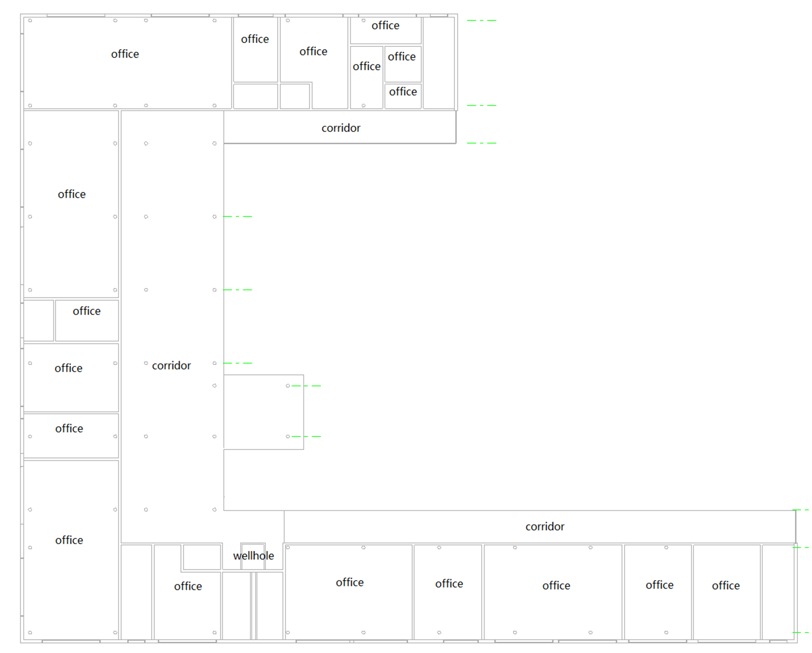
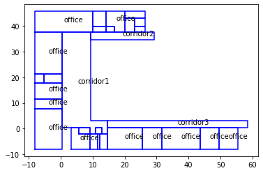
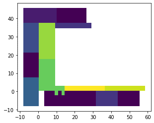

<div align=center></div>

# Background

## Why need to zone construction for smoke control? Is it necessary?

Proactive restriction on smoke diffusion plays an significant role in increasing occupant evacuation time. Regardless in U.S or China, relevant construction codes require almost public buildings to establish effective smoke control system in case of emergency. Active smoke exhaust and pressurisation systems are complex and under strict supversion.

Generally, in China, the construction smoke control system can be divided into two parts: **Zone pressurisation system** for stairwell (emergency exits), and **Smoking exhausting system** for fire affected zones. **Zoning construction** for smoke-control is necessary for **layout of Smoke exhausting system**, whose goals is to <u>passive separation between fire affected zones and non-fire affected zones</u>. It can slow down the smoke diffusion to increase the chance of surivival.

## How to utilise BIM to auto-zone?

Building Information Model (BIM) give us a shot to liberate engineers from trivial things. It is considered to be a standard data structute designed for construction industry. Among the known examples are **IFC** and **gbXML**. If you are familiar with Building Energy Simulation programs, including **EnergyPlus** and **DeST**, these programs have built-in data file to record bulding information. No matter what data file you choose, theoritically, the construction geometry and basic layout information can faciliate zoning constuction automatically. Last but not least, your code have to comply with the relevant construction code.

# General Workflow

The next part is based on the China's construction code, inlduing GB-51251-2017 and ect.. *This is not a technical report, so the technical details are not disclosed*. Hope you can draw inspiration from this article to achieve your goal.


flowchart TB
A[(BIM)] --> B["geometry/layout/use"]
A --> C[limitation related to anti-smoke zoning]
B & C -.for each space.-> D{"necessary to zone?"}
D -.N.-> D1[/Done/]
D -.Y.-> D2[check geometry and use]
D2 -.Construction Code.-> E[this space belongs to one anti-smoke zone?]
E -.Y.-> G[/Done/]
E -.N.-> F[divided into several subspaces]
F --> H[subpaces belongs to different anti-smoke zones]
H & D1 & G --> I[equip each anti-smoke zone with at least one extraction fan]
I --> J{{"Done (next: design smoke exhausting systems)"}}

&nbsp;

# Steps in Workflow

1. Three kinds of information need to be extracted from **BIM**. For example. The idf format file, supported by EnergyPlus, can provide us with the **geometry, layout and use information**, which is enough as foundation.
  
2. Equally important is **some prior limits** in relevant construction code. Set China's code as an example, before this zoning, another zoning for fire safety is necessary. The details is that every zone for smoke control cannot cross zones for fire safety. according the above limits, the information about zones for fire safety cannot be ignored.
  
3. The first judement means that zoning for *smoke control is not necessary for all spaces*. For exampe. stairwells do not belong to this. so this exclusion can help us know the range that needs to be zoned for smoke control.
  
4. **Checking geometry and use for every space is core**. Generally architects will give difference spaces different uses. For example. **Space 1 is for conference, and Space 2** is for lobby, When it comes to zoning for smoke control, **Space 1 and 2** need to follow different criteria.
  
5.  :dart: If a space is really small or have exterior window, it might belong to a zone for smoke control. However, if a space is really large and not connected with outdoor (by window or door), it is necessray to divide it into several zones for some control, which means more than one exhuastion fan will be installed for safety.
  
6. About how to divide one large into several subspace. That is a mathematic problem mixed with engineering situations. that is not our focus here.
  

# Example

An brief introduction of example will be shown here to guide some guys who are really insterested in this. I will attach some really **useful toolkits**. Practice makes perfect, also can generate new inspiration. Presume that I do not have construction data in hand. I'll show you how to do this auto-zoning from scratch.


flowchart LR
A([OpenStudio]) -->|software| C["convert to .idf file"]
B([SketchUp]) -->|Plug-in| C["convert to .idf file"]
C -->|check| D([EnergyPlus])
D --> E([Python])
F([eppy]) -->|package| G{{auto-zone for smoke control}}
E -->|coding| G


The above flowchart shows all the **toolkits** I used in this auto-zoning.

1. **SketchUp**: you might be really familiar with this software if your major is architecture design. This software can visualize the dream construction in your head. but in this work, we need to use another Plug-in to build a 3D-model that can be identified by EnergyPlus.
  
2. **OpenStudio**: this is an open-source platform. The earlier version is the SketchUp Plug-in, but the lastet version is more like a platform. You can do a lot related to building energy consumption on this platform. You can use `< 3.0.0` version of OpenStudio in SketchUp.
  
3. **EnergyPlus**: In Windows, EnergyPlus has interface to check and modify your .idf format file (you can get `.idf` format file with help of OpenStudio Plug-in in SketchUp). If you are new to EnergyPlus, that will be user-friendly. Or you can use other editor to open it, which is really easy for veterans.
  
4. **Python**: Compared with other languages, Python development communtiy provides some third-party packages to support .idf format files, which will facilitate the procedure.
  
5. **Eppy**: The first time I found this package, I was really excited. That is a wonderful bridge between EnergyPlus and Python. EnergyPlus has built-in Python API though, but I never use it. I prefer using Eppy. You can go to the [official website](https://eppy.readthedocs.io/en/latest/Main_Tutorial.html) to appreciate its power.
  

# Additional Illustration

1. This picture shows the floorplan of a building that I use as a case. the first step is to convert this floorplan to `.idf` files. We have already known **the use, shape and area of every space**.

<div align=center></div>

2. The next picture is visulationzation of geometry infomation in `.idf` format file. This visualization is supported by `Matplotlib`.

<div align=center></div>

3. Next I will use an example to show you what's a `.idf` format file. In `.idf` file, every space is simplified as geometry. You can get every surface infomation in `.idf` file. For example, **next code block** is the description of a surface, you can which space it belongs to, it is wall, or floor, or root, or ceiling. it is exterior or interior. That is really wonderful for us to achive our goal. You can move to [official documentations](https://energyplus.net/documentation) to see more details.

```
BuildingSurface:Detailed ,Zn005:Wall005 , !- Base Surface Name
Wall,INTERIOR , !- Class and Construction Name
MAINE WING, !- Zone
Surface ,Zn001:Wall009 , !- Exterior Conditions and Target
NoSun , !- Solar Exposure
NoWind , !- Wind Exposure
0.5000000 , !- VF to Ground
4, !-Rectangle
57.90000 , 47.79000 , 10.00000 ,
57.90000 , 47.79000 , 0.0000000E+00,
67.90000 , 47.79000 , 0.0000000E+00,
67.90000 , 47.79000 , 10.00000 ;
```

4. Last I will show you the result, different colorful blocks means different zones for smoke control, (P.S. the whole floor belongs to the same zone for fire safety), **you can see that the Corride 3 has been divided into two zones for smoke-control**, because it is really elongated. The relevant code requires that. Further designers will seperate **Corridor 3** with **fire curtains**. This result is the foundation of designing smoke exhausting systems.

<div align=center></div>

5. **wellcome to cite the relevant patent:**, if you are really interested in this blog, or get some inspiration from this, or have some questions, don't hesitate to contact me. You can click the upper-right GitHub icon.

```
%0 Patent
%T A method for autozoning contruction for smoke control
%A RK, HE; P XU; JF GU
%8 2022-04-19
%@ CN113221205B
%9 Invention Authorization
%~ CN Patent
PageCount 11
%W CNKI
```

# Acknowledge
1. The first picture cited at the beginning is from [Unsplash.com](https://unsplash.com/) and Photographer [*Bernard Hermant*](https://unsplash.com/@bernardhermant)

2. This work is one part of a larger project about Auto-Design for HVAC System of Public Buildings. The inital floorplan here is one of the test models for this lager project.

# Reference

1. [Understanding Smoke Control in Building](https://sourceable.net/understanding-smoke-control-in-buildings/)
  
2. [About the IFC File Format | Revit 2021 | Autodesk Knowledge Network](https://knowledge.autodesk.com/support/revit/learn-explore/caas/CloudHelp/cloudhelp/2021/ENU/Revit-DocumentPresent/files/GUID-0D546BEA-6F88-4D4E-BDC1-26274C4E98AC-htm.html)
  
3. [Green BuildingXML (gbXML) is the language buildings...](https://www.gbxml.org/)
  
4. [Homepage | EnergyPlus](https://energyplus.net/)
  
5. [Homepage | DeST](https://www.dest.net.cn/zy)
  
6. [Homepage | SketchUp](https://www.sketchup.com/)
  
7. [OpenStudio<sup>&reg;</sup> SDK User Docs](https://nrel.github.io/OpenStudio-user-documentation/)
  
8. [Python](https://www.python.org/)
  
9. [Eppy Tutorial &#8212; eppy 0.5.62 documentation](https://eppy.readthedocs.io/en/latest/Main_Tutorial.html)